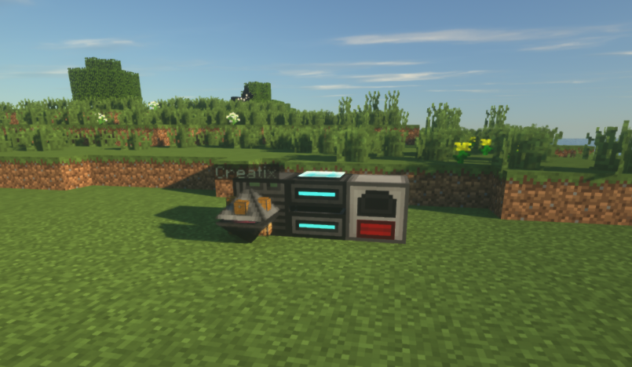
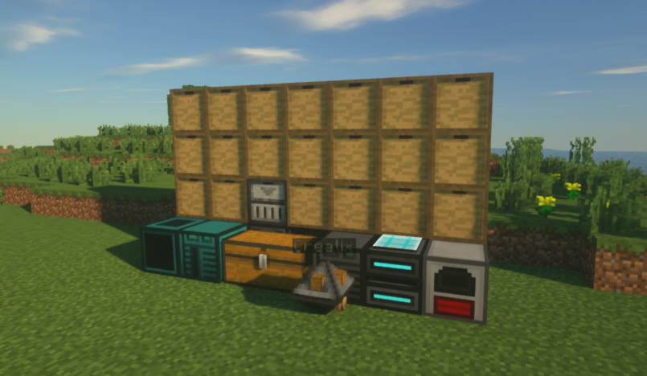

[](https://discord.gg/YxHGxVs)

# oc-automate_everything
Minecraft opencomputers project. Aimed for automating everything in a system.\
Starting from a robot and a computer, then they expand themselves into an unlimited resource generator!

## Why a robot and a computer?
Because a robot cannot eject a floppy disk from itself, also cannot start the assembler machine alone.

\
**Image 1** - Replication Station.

\
**Image 2** - Replication Station with Storage and Crafting Station.

## Dependencies
This project will require these mods to work.
- Minecraft 1.12.2, as I'm working on OC mod for Minecraft 1.12.2.
- OpenComputers, simply for computers!
- Storage Drawers, for compact and quick item retrieval.
- Extra Utilities 2, for generators.
- CraftTweaker 2, for recipe stealing. If you're going to do it manually, you can opt this out :p

## Recommended Mods
This project are not really needed, but will help you look what's happening, and it's extremely useful.
- Here's What You're Looking At, simply HWYLA (fork of WAILA).
- Just Enough Items, simply JEI.

## Quick Installation
For floppy:\
```wget https://raw.githubusercontent.com/ayangd/oc-automate_everything/master/installer.lua autoAllInst.lua```

For oldfloppy (deprecated):\
```wget https://raw.githubusercontent.com/ayangd/oc-automate_everything/master/oldinstaller.lua autoAllInst.lua```

>Note: Running these commands will extract files directly around it (Current directory).

## Progress
### Libraries/Utilities
|Library Name|Status|
|-|-|
|Robot navigation library|Not yet|
|Resource library|Currently WIP|
|Inventory library|Gradually building up|
|Communication library|Not yet|
|Chest communication library|Not yet or never|

### Subsystems
|System Name|Status|
|-|-|
|Mining system|Not yet|
|Logging system|Not yet|
|Replication system|Not yet|
|Storage system|Not yet|
|Logistic transportation system|Not yet|
|Integrated GUI system|Not yet|
|Extra: Infrastructure building system|Not yet|

**Gradually building up* - will get improvement overtime

## How to try?
You'll need a `Creatix` and an empty floppy disk.
Change directory to the empty floppy disk, then follow the [Quick Installation](#quick-installation).

## What can I try?
>Note: These programs need to be run directly from the disk.

### floppy

#### craftmgr.lua
You can try running `craftmgr` and run these lines of code slowly:
```
help
    Not a code: Press the space key to scroll down.
select 8
	Not a code: Put down cobblestone slab recipe into the robot's crafting grid
analyze crafting shaped
see slot
keep slot
keep minecraft:sand
save
traceraw opencomputers:case2
	Not a code: Put all raw ingredients into the robot's inventory
rescan
craft opencomputers:case2
exit
```

#### filter.lua
Before you can run `filter`, you will need `crafttweaker.log` in your current working directory.\
If it's not there yet, you can do the following:
1. Go to %appdata%\.minecraft\scripts and put recipeStealer.zs into it.
2. Start up Minecraft 1.12.2. If you're running it, then restart.
3. Copy %appdata%\.minecraft\crafttweaker.log into %appdata%\.minecraft\saves\<Your save world name>\opencomputers\<Your floppy id containing this project>

Run `filter`. You'll see crafting.db, ordict.db, and failure.txt being spit out.\
This is the beast of the project. I'm so happy I made this thing, while nobody made it (in my perspective).

>Note: If you struggle reading errors, please use `ct <lua file>` and check `ct.txt` for errors.

### oldfloppy
You can try running `craftingmanager` and run these lines of code slowly:
```
help
    Not a code: Scroll down by pressing the `space` key until it finishes printing.
load all
    Not a code: Put a cobblestone stairs' recipe into the robot's crafting grid
    Not a code: Empty slot 8
select 8
analyze shaped true
show slot
keep
save crafting
list crafting
trace opencomputers:case2
    Not a code: Put all raw ingredients into the robot's inventory
craft opencomputers:case2
exit
```
>Note: If you struggle reading errors, please use `crashtracker <lua file>` and check `crashtracker.txt` for errors.

## Suggestions Welcome
If you want to help me improve, let me know by opening an issue :)\
But, if you want to give quick suggestion, come join the [Discord Server](https://discord.gg/YxHGxVs).
