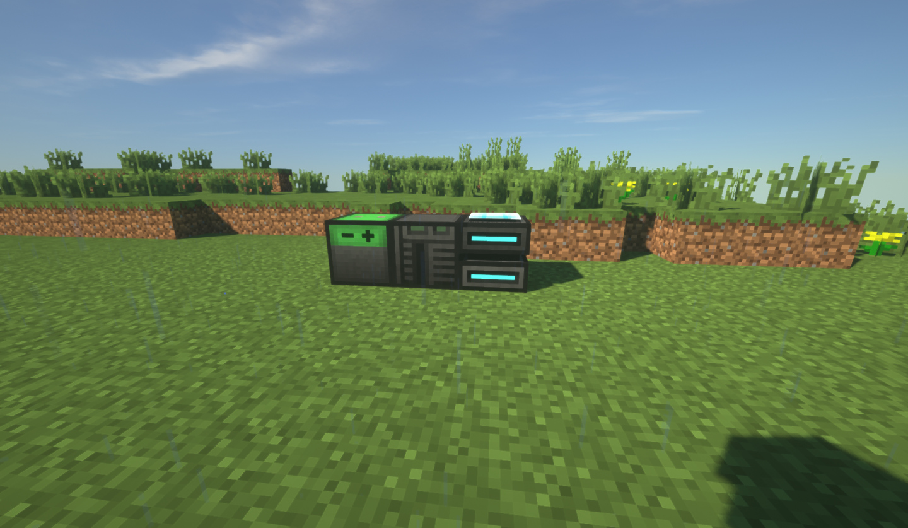

# oc-automate_everything
Minecraft opencomputers project. Aimed for automating everything in a system.  
Starting from a robot and a computer, then they expand themselves into an unlimited resource generator!

## Why a robot and a computer?
Because a robot cannot eject a floppy disk from itself, also cannot start the assembler machine alone.


**Image** - Minimal computer.

## Progress
### Libraries/Utilities
- Robot navigation system [Gradually Building Up]
- Crafting system [Currently WIP]
- Smelting system [Not yet]
- Inventory system [Gradually Building Up]
- Logistic system [Not yet]
- Communication system [Not yet]
- Chest communication system [WIP]

### Subsystems
- Mining system [Not yet]
- Logging system [Not yet]
- Replication system [Not yet] [Planned Next]
- Storage system [Not yet]
- Player interface [Not yet]
- Extra: Infrastructure building system [Not yet]

## How to try?
External: Retrieve this repository's content.  
Ingame: Put a `Creatix` on the ground and insert an empty floppy disk into the robot's slot.  
External: Copy all of the 'floppy' folder content from the repository into the floppy disk folder inside your minecraft save world.  
Ingame: You pull the empty floppy disk and then put it back again.  
Ingame: You need to be in the floppy's root directory before executing any of the programs, e.g: `/mnt/875/`

## What can I try?
You can try running `craftingmanager` and run these lines of code slowly:
```
help
    Not a code: You scroll down by pressing the `space` key until it finishes printing.
load all
    Not a code: You put a cobblestone stairs' recipe into the robot's crafting grid
    Not a code: Empty slot 8
select 8
analyze shaped true
show slot
keep
save crafting
list crafting
trace minecraft:diamond_pickaxe
trace minecraft:chest
	Not a code: Put two logs in the robot's inventory
craft minecraft:chest
exit
```
>Note: If you struggle reading errors, please use `crashtracker <lua file>` and check `crashtracker.txt` for errors.

## Suggestions Welcome
If you want to help me improve, let me know by opening an issue :)
